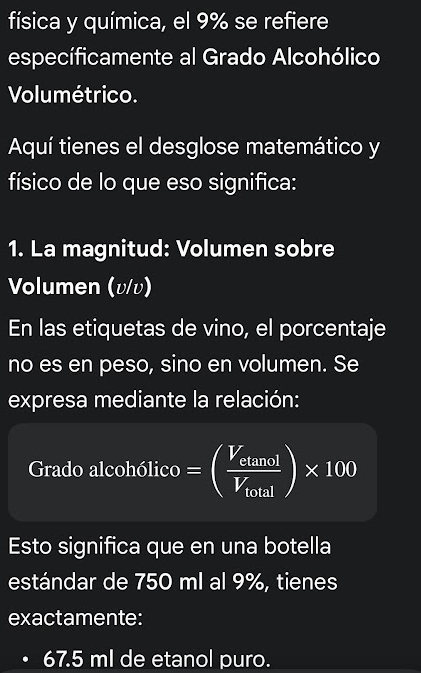
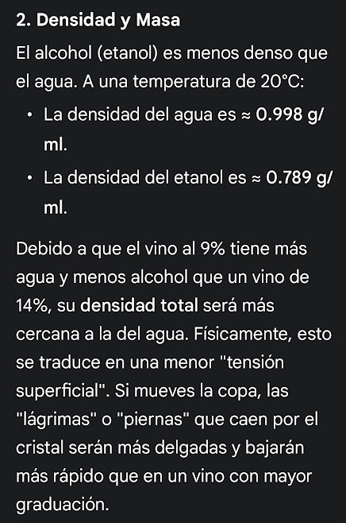
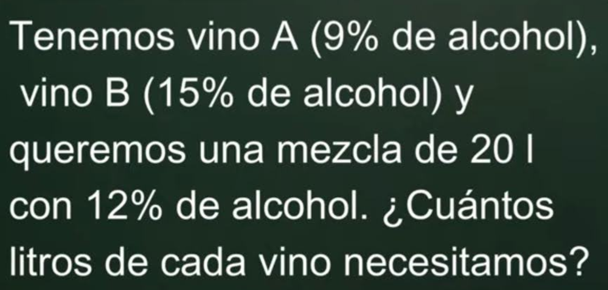
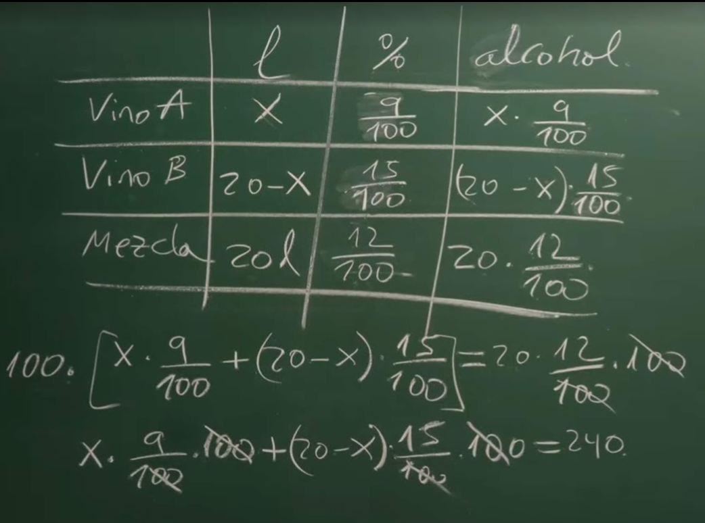
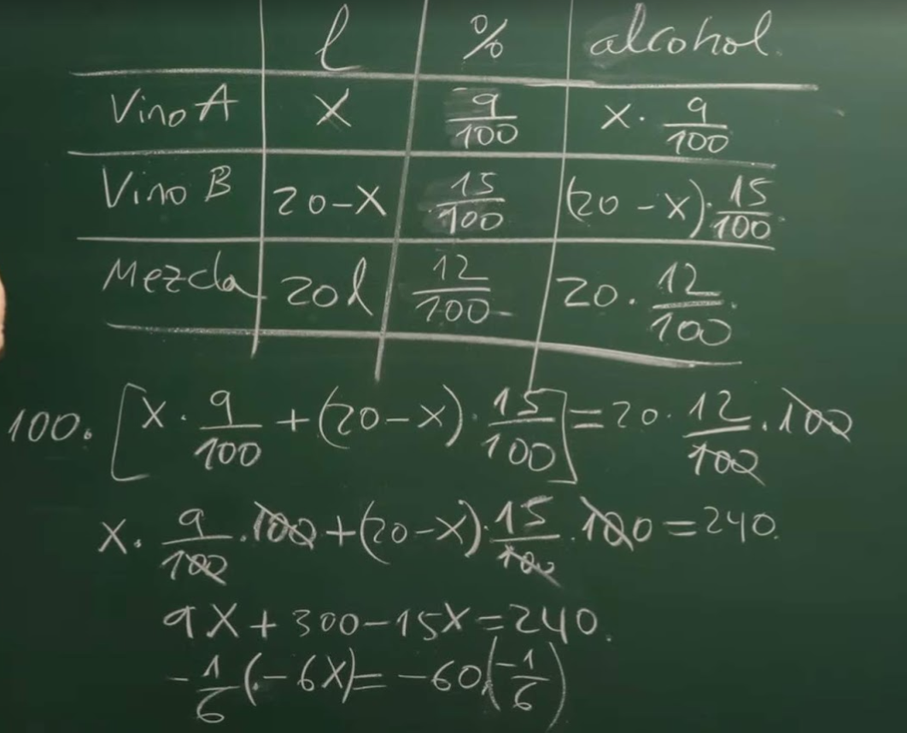

3. Aplicación para el Guión
Basándome en las fotos, tu video puede estructurarse así:

Introducción: ¿Por qué flota el densímetro? Explicar que el vino no es solo agua, sino una mezcla de azúcares, ácidos y alcohol.

La Ciencia: Mostrar la imagen del densímetro y explicar que el alcohol etílico tiene una densidad de aprox. 0.789 g/ml (más ligera que el agua), por lo que un vino con más alcohol hará que el densímetro se hunda más.

Demostración Práctica: Usar las fotos de las probetas para mostrar cómo se hace una lectura real y cómo interpretar los números en la escala.

Título: ¿Por qué el alcohol cambia el peso del vino?TiempoImagen Sugerida (de tu álbum)Locución (Voz en Off)0:00Foto del vino servido en la probeta."¿Alguna vez te has preguntado cómo sabe un enólogo cuánto alcohol tiene un vino antes de que esté terminado?"0:10El densímetro flotando en la probeta."La respuesta está en la densidad. El vino es básicamente una mezcla de agua, azúcar y alcohol. Y cada uno tiene un 'peso' distinto."0:20Primer plano de la escala graduada del densímetro."Antes de fermentar, el mosto está lleno de azúcar y es denso, como un almíbar. Por eso, este instrumento llamado densímetro flota muy arriba."0:35Foto del densímetro más hundido en el líquido."Pero aquí ocurre la magia: las levaduras se comen el azúcar y la transforman en alcohol. Como el alcohol es más ligero que el agua, el líquido pierde densidad."0:50Comparativa de dos fotos (densidad alta vs. baja)."Es física pura: a medida que hay más alcohol, el densímetro se hunde más. Midiendo esa diferencia entre el inicio y el final, calculamos el grado alcohólico exacto."1:05Foto detalle del vino y las burbujas o color."Así, la densidad no solo nos dice cuánto alcohol hay, sino que nos avisa cuándo la fermentación ha terminado por completo."1:15Foto final del equipo (probeta y densímetro)."La próxima vez que brindes, recuerda: ¡hay mucha ciencia flotando en tu copa!"

Notas para la edición:El tono: Debe ser curioso y cercano, como si estuvieras revelando un secreto profesional.Dato clave para tu voz en off: Puedes mencionar que la densidad del agua es $1.000$, mientras que la del alcohol es aproximadamente $0.789$. Si el densímetro baja de $1.000$, ¡es que tienes un vino bien seco!

Explicaremos las magnitudes (masa, volumen), sus unidades en el Sistema Internacional y la fórmula que conecta todo.Aquí tienes la versión actualizada para el guión:Título: La Física del Vino: Densidad y GraduaciónTiempoImagen SugeridaLocución (Voz en Off)0:00Foto de la probeta con vino."¿Cómo transformamos una medida física en un porcentaje de alcohol? Todo se resume a una magnitud fundamental: la densidad."0:12Texto en pantalla: $\rho = \frac{m}{V}$"La densidad, representada por la letra griega rho ($\rho$), es la relación entre la masa de una sustancia y el volumen que ocupa. En enología, la medimos generalmente en gramos por mililitro (g/ml) o gramos por litro."0:25El densímetro flotando."Para calcularla, necesitamos un volumen exacto. Al llenar esta probeta, conocemos el espacio ($V$). El densímetro, por el principio de Arquímedes, nos indica la masa de ese líquido desplazado."0:40Gráfico o texto: Agua ($1.000$ g/ml) vs Alcohol ($0.789$ g/ml)."Aquí entra el rigor matemático: el agua pura tiene una densidad de $1.000$ g/ml. En cambio, el etanol es mucho menos denso, apenas $0.789$ g/ml. Es una diferencia de magnitud considerable."0:55Foto de la escala del densímetro."Al inicio, el mosto tiene una densidad alta (pizca de $1.100$ g/ml) debido a la masa del azúcar disuelto. Pero a medida que el azúcar desaparece y el alcohol aparece, la densidad total de la mezcla disminuye drásticamente."1:10Texto: $(Di - Df) \times 131.25 = \% ABV$"Para hallar el grado alcohólico, restamos la densidad final de la inicial. Esa diferencia se multiplica por una constante matemática ($131.25$ aproximadamente) que nos da el volumen de alcohol por cada 100 ml de vino."1:25Foto final del equipo."Precisión en las unidades y rigor en el cálculo: así es como la física nos permite embotellar la perfección. ¡Salud por la ciencia!"Detalles técnicos añadidos para tu conocimiento:Unidades: He especificado g/ml, que es lo más común en laboratorio, aunque en la industria a veces se habla de densidad relativa (sin unidades) comparada con el agua.Volumen ($V$): Es vital mencionar que el volumen debe ser constante para que la lectura sea comparable. Las probetas de tus fotos aseguran que el densímetro tenga espacio para desplazarse verticalmente sin tocar las paredes.La Constante ($131.25$): Este número es el factor de conversión estándar que relaciona la pérdida de densidad con la creación de etanol y la liberación de $CO_2$.Temperatura: Si quieres añadir un toque de rigor extra, podrías mencionar que la densidad se mide siempre a 20°C, ya que el volumen de los líquidos cambia con la temperatura.

¡Excelente observación! Incluir el factor de la temperatura es lo que diferencia a un aficionado de un profesional o un científico. Los líquidos se expanden con el calor (aumenta el volumen, baja la densidad) y se contraen con el frío, por lo que sin una temperatura de referencia, la medición no sería válida.Aquí tienes el guión definitivo con ese toque de rigor extra integrado:Título: La Física del Vino: Densidad, Temperatura y GraduaciónTiempoImagen Sugerida (Álbum)Locución (Voz en Off)0:00Foto de la probeta con vino."¿Cómo transformamos una medida física en un porcentaje de alcohol? Todo se resume a una magnitud fundamental: la densidad."0:12Texto: $\rho = \frac{m}{V}$"La densidad ($\rho$) es la relación entre la masa de una sustancia y el volumen que ocupa. En el laboratorio, la expresamos en gramos por mililitro (g/ml)."0:25¡Nuevo detalle! Termómetro o el densímetro."Pero hay un factor crítico: la temperatura. El volumen de los líquidos cambia con el calor, por eso, para que el dato sea riguroso, las mediciones deben hacerse siempre a 20°C."0:40Gráfico: Agua ($1.000$) vs Etanol ($0.789$)."A esa temperatura, el agua pura tiene una densidad de $1.000$ g/ml, mientras que el etanol es mucho más ligero: solo $0.789$ g/ml."0:55Foto de la escala del densímetro."Al inicio, el azúcar hace que el mosto sea denso (cerca de $1.100$ g/ml). Pero según las levaduras crean alcohol, la densidad total de la mezcla cae por debajo de la del agua."1:10Texto: $(Di - Df) \times 131.25 = \% ABV$"Usando la diferencia entre la densidad inicial y final, y aplicando una constante de conversión, obtenemos el volumen de alcohol por cada 100 ml de vino."1:25Foto final del equipo."Masa, volumen, temperatura y precisión. Así es como la ciencia nos permite entender la vida dentro de una botella. ¡Salud!"Por qué este guión es ahora más profesional:La Dilatación Térmica: Al mencionar los 20°C, explicas implícitamente por qué el densímetro (que es un instrumento calibrado) tiene esa temperatura grabada en el cristal.Consistencia de Magnitudes: Mantienes la relación masa/volumen clara, reforzando que si el volumen ($V$) cambia por la temperatura, la densidad ($\rho$) calculada sería errónea.Visuales: Si en tus fotos del álbum aparece algún termómetro o si puedes grabar un clip corto midiendo la temperatura, el video ganará muchísima autoridad didáctica.¡Ya tienes un guión sólido y con rigor científico! ¿Necesitas alguna otra fórmula o ajuste para el cierre?

Estab viendo este video :

Ejemplo:
“There is no better, no more open door by which you can enter into the study of science than by considering the physical phenomena of a candle,” said British chemist Michael Faraday in 1848." 
El libro es considerado un ejemplo magistral de cómo la ciencia puede ser accesible, didáctica y fascinante para todas las edades
"La historia química de una vela" (The Chemical History of a Candle):
Contexto: Fueron parte de las célebres Conferencias Navideñas para jóvenes (Christmas Lectures) que Faraday fundó y promovió en la Royal Institution de Londres.
Fechas: Aunque dio conferencias sobre el tema en 1848, la serie más célebre se impartió durante la Navidad de 1860-1861.
Temática: Faraday utilizó una simple vela para explicar principios fundamentales de la química y la física, incluyendo la combustión, los estados de la materia, la producción de gases (hidrógeno, oxígeno, nitrógeno, dióxido de carbono), la capilaridad y la respiración humana.
Publicación: Las conferencias fueron transcritas y publicadas en formato libro, convirtiéndose en un clásico de la literatura científica que sigue vigente hoy en día.
Filosofía: Faraday sostenía que no había mejor manera de introducirse en el estudio de la ciencia que a través de los fenómenos físicos de una vela. 

Michael Faraday, quién fue y porqué se hacía esas preguntas ?
https://www.youtube.com/watch?v=PQL3H42Kgvo
“Fuente: [Nombre del Canal/Autor]” o “Imágenes de: [Título del Video]”.
La Regla de los "7 Segundos" y la Transformación
No es una ley escrita, pero en plataformas como YouTube, usar clips de menos de 5-7 segundos suele evitar que los algoritmos de copyright salten automáticamente.

El truco: Nunca dejes el audio original del video ajeno como protagonista. Mantén tu voz en off explicando el concepto encima de las imágenes. Esto se considera "contenido transformativo" (estás aportando valor, no solo resubiendo).

2. El Efecto "Picture-in-Picture" (Imagen sobre imagen)
En lugar de poner el video ajeno a pantalla completa, ponlo en un recuadro más pequeño sobre un fondo o sobre tu propio video.
Michael Faraday para mí es el mejor científico de todos los tiempos, para los seguidores de Date Un Vlog está en el número 7, un hombre que cambió completamente nuestro mundo a través de su forma de ver la electricidad y el magnetismo.
