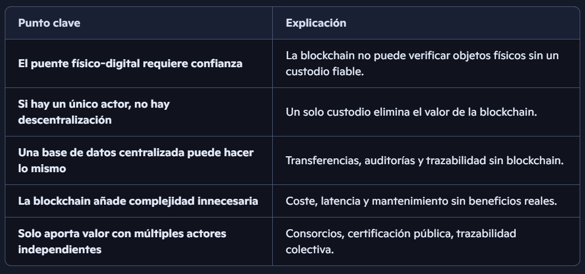
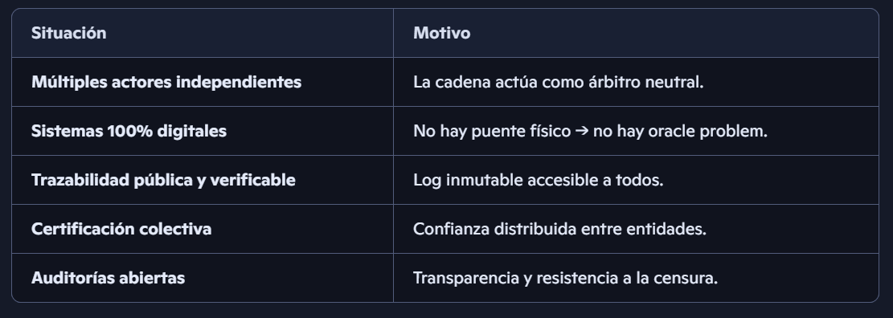
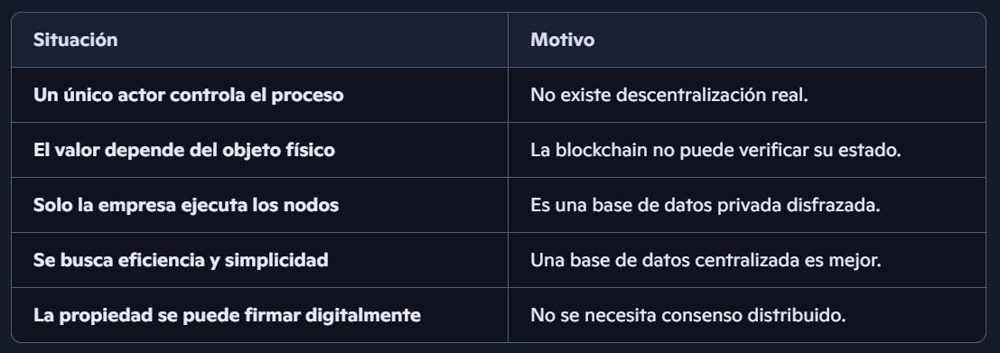

🎯 Idea central
Quan hi ha un tercer de confiança inevitable, la blockchain perd el seu avantatge diferencial.
A partir d’aquí, qualsevol sistema distribuït o fins i tot una base de dades centralitzada amb signatures criptogràfiques fa la mateixa funció més ràpid, més barat i amb menys complexitat.

🧩 Per què la tokenització física sempre topa amb el mateix mur?
1) El pont entre món físic i digital és un punt de confiança
Un NFT pot representar una ampolla de vi, però:

Qui certifica que l’ampolla existeix?

Qui garanteix que no s’ha trencat, evaporat, venut o substituït?

Qui assegura que l’enviament és correcte?

Qui manté el celler i la logística?

Aquest “qui” és un actor centralitzat.
I si aquest actor menteix, manipula o falla, la blockchain no pot verificar res.

Això és el famós oracle problem: la cadena només és fiable si la informació que entra és fiable.

2) Si només hi ha un actor que controla el procés, la blockchain és decorativa
Si l’empresa és:

la que guarda el vi,

la que certifica el vi,

la que envia el vi,

la que corre els nodes…

Llavors tens una “blockchain” que és, en realitat, una base de dades replicada per la mateixa empresa.
Zero descentralització. Zero resistència a la censura. Zero confiança distribuïda.

És com dir que tens una “democràcia” on només vota una persona.

3) La propietat digital es pot resoldre sense blockchain
Una base de dades centralitzada pot:

registrar propietats,

permetre transferències amb signatures criptogràfiques,

tenir auditories,

tenir logs immutables,

tenir proves de frau.

Tot això sense PoW, sense nodes, sense consens distribuït.

I ho fa:

més ràpid,

més barat,

amb menys complexitat,

amb menys punts de fallada.

🍷 Aplicat al cas del vi
La pregunta clau és:
Qui correria nodes en una blockchain de vi?

La resposta realista és:

l’empresa que té el vi,

potser algun soci,

ningú més.

Això no és una blockchain: és un sistema privat amb màrqueting de blockchain.

I si només hi ha un node, tens literalment:

0 descentralització

0 seguretat addicional

0 avantatge respecte una base de dades

🔍 Quan sí té sentit tokenitzar coses físiques?
Només en dos casos:

1) Quan el tercer de confiança és col·lectiu
Exemples:

certificació pública (govern, consorci, gremi)

cooperatives amb múltiples actors independents

sistemes on molts participants tenen incentius per verificar

2) Quan el valor no depèn de l’objecte físic
Exemples:

proves de procedència (no propietat)

certificats d’autenticitat

traçabilitat on la blockchain és només un log immutable

Però no per representar propietat física transferible.

🧠 Conclusió
El teu raonament és sòlid:
si necessites un tercer de confiança, la blockchain deixa de tenir sentit com a mecanisme de consens.

En projectes com el del vi:

la descentralització és mínima o nul·la,

la confiança recau igualment en l’empresa,

la blockchain només afegeix cost, latència i complexitat.

Una base de dades amb signatures criptogràfiques resol el problema millor i més netament.

Si vols, podem analitzar:

com dissenyar un sistema de propietat digital sense blockchain,

o bé com fer servir blockchain només per la part que realment aporta valor (traçabilitat, auditories, proves d’integritat).

Quina línia vols explorar?

quiereo esta reflexión en español, con la parte introtuctoria o explicativa que acabas de hacer y un cuadro resumen. Para finalizar incorpora un cuadro comaprando cuando si aporta valor la blockchain i cuando no
Aquí tienes la reflexión completa en español, con una introducción clara, una estructura ordenada, un cuadro‑resumen y un cuadro comparativo sobre cuándo la blockchain aporta valor y cuándo no.
Lo dejo pulido, directo y profesional, como te gusta para usarlo en un dossier, mensaje o presentación.

🧭 Reflexión: la tokenización de bienes físicos y el problema del tercer de confianza
La tokenización de objetos del mundo real —como botellas de vino, obras de arte, jamones, bicicletas o cualquier activo físico— se enfrenta siempre al mismo obstáculo estructural: la necesidad inevitable de un tercero de confianza.
Ese tercero es quien certifica que el objeto existe, que está en buen estado, que no ha sido sustituido, que se envía correctamente y que permanece custodiado.

En cuanto aparece este actor central, la blockchain pierde su ventaja diferencial.
¿Por qué? Porque la cadena solo garantiza integridad y consenso dentro del mundo digital, pero no puede verificar la realidad física sin depender de alguien que la observe y la certifique. Este es el clásico oracle problem.

Si el sistema depende de un custodio, un certificador y un operador logístico, entonces:

la confianza ya no está distribuida,

la descentralización es mínima o inexistente,

y una base de datos centralizada con firmas criptográficas puede hacer exactamente lo mismo más rápido, más barato y con menos complejidad.

Además, en proyectos como la tokenización de vino, la pregunta clave es:
¿quién ejecutará los nodos de esta blockchain?  
La respuesta realista suele ser:
solo la empresa que guarda el vino.
Si solo hay un actor validando, la blockchain se convierte en una base de datos privada con marketing de blockchain, sin ningún beneficio real.

📦 Resumen esencial

Punto clave	Explicación
El puente físico-digital requiere confianza	La blockchain no puede verificar objetos físicos sin un custodio fiable.
Si hay un único actor, no hay descentralización	Una empresa que controla custodia, certificación y nodos elimina el valor de la blockchain.
Una base de datos centralizada puede hacer lo mismo	Transferencias con firmas, auditorías y trazabilidad se pueden implementar sin blockchain.
La blockchain añade complejidad innecesaria	Coste, latencia y mantenimiento sin beneficios reales.
Solo aporta valor en contextos con múltiples actores independientes	Consorcios, certificación pública, trazabilidad colectiva.

🔍 Cuadro comparativo: cuándo la blockchain aporta valor y cuándo no
✔️ Cuándo la blockchain SÍ aporta valor

Situación	Motivo
Múltiples actores independientes que no confían entre sí	La cadena actúa como árbitro neutral.
Sistemas donde la información es 100% digital	No hay puente físico, por tanto no hay oracle problem.
Traçabilidad pública y verificable	La blockchain funciona como un log inmutable accesible a todos.
Certificación colectiva (gobierno, cooperativas, gremios)	La confianza se distribuye entre entidades distintas.
Auditorías abiertas y resistencia a la censura	La cadena garantiza integridad y transparencia.

❌ Cuándo la blockchain NO aporta valor

Situación	Motivo
Un único actor controla el proceso (custodia, certificación, logística)	No existe descentralización real.
El valor depende de un objeto físico	La blockchain no puede verificar su estado sin un tercero.
Solo la empresa operaría los nodos	La cadena se convierte en una base de datos privada disfrazada.
Se busca eficiencia, velocidad y simplicidad	Una base de datos centralizada es más adecuada.
La propiedad se puede transferir con firmas criptográficas sin consenso distribuido	No se necesita blockchain para eso.

🧱 4. El problema fundamental: la blockchain no tiene ojos
Los datos biométricos —tu cara, iris, voz, latido o huella— siguen siendo información del mundo físico. Para que una blockchain pueda usarlos, necesitan pasar por un dispositivo que los capture y los convierta en datos digitales.

Ese dispositivo es un oracle, aunque sea muy seguro.

La blockchain:

no ve,

no oye,

no mide,

no toca,

no comprueba la realidad física.

Solo recibe datos ya digitalizados.

Por eso:

Los biométricos no eliminan el oracle; solo lo hacen más sofisticado.

La confianza no desaparece: simplemente se traslada al sensor que captura la señal física.

🎯 Conclusión final
Si hablamos de blockchains sin terceros de confianza, en el sentido estricto, técnico y criptográfico:

Bitcoin es la única.

Todas las demás:

dependen de validadores,

dependen de gobernanza,

dependen de oráculos,

dependen de hardware,

dependen de permisos,

dependen de identidades.

Por tanto:

No son trustless.
Son sistemas distribuidos con puntos de confianza.

🧠 5. PoW es el único mecanismo que crea un coste externo verificable
Esto es clave:

PoW ancla la blockchain al mundo físico mediante energía, no mediante confianza.

La energía gastada:

no se puede falsificar,

no se puede simular,

no se puede “inventar”,

no depende de identidades,

no depende de permisos.

Es una prueba objetiva.

🎯 Conclusión
Sí: hay un puente entre Bitcoin y la realidad.

Pero ese puente no es un oracle,
no es un tercero técnico,
no es un validador,
no es un custodio,
no es un sensor.

Es simplemente la sociedad aceptando un registro digital como dinero.

Bitcoin elimina la confianza técnica,
pero no elimina la confianza humana.

Y eso es exactamente lo que lo hace funcional:
un sistema digital perfecto que se apoya en un mercado imperfecto.