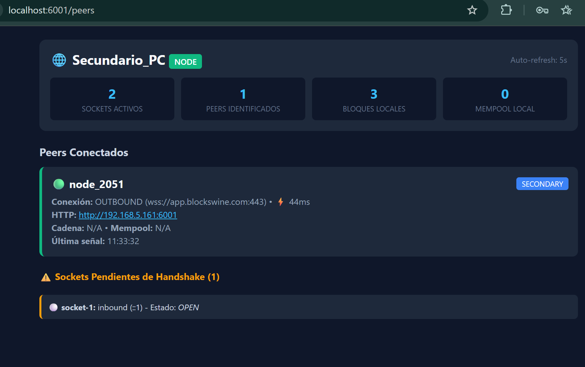

# Arquitectura de Descubrimiento, Observabilidad y Control P2P
**Fase:** Test / Prototipo (Diseñada para no romper el flujo actual de mempool y minería)

---

## 1. Objetivo y Visión General

Pasar de 2 nodos a una red de **15 a 20 nodos** (secundarios, réplicas, mineros y bodegas locales) sin tener que mantener listas cruzadas de IPs/dominios en variables de entorno.

### Principio Fundamental: Bootnode Dinámico (Seed)
* El nodo desplegado en **Seenode** (`app.blockswine.com`) actúa como **Bootnode (semilla)** central.
* Los nodos secundarios (**Railway**, réplicas cloud o bodegas locales) solo necesitan conocer la URL del Bootnode para incorporarse a la red.
* **Topología recomendada para esta fase:** **Estrella (Hub-and-Spoke)**.
  * Todos los nodos conectan al Bootnode mediante WebSockets persistentes (`wss://`).
  * El Bootnode propaga bloques y transacciones por los sockets abiertos.
  * *Ventaja crucial:* Permite que nodos detrás de NAT (enrutadores de bodegas o redes residenciales) participen plenamente sin abrir puertos ni configurar port forwarding.
  * Evita la complejidad de bucles de mensajes (*broadcast storms*) asociada a mallas completas sin deduplicación avanzada.

```mermaid
graph TD
    subgraph "Seenode (Bootnode / Seed Central)"
        Relay["Relay Master (app.blockswine.com)<br/>ROLE=relay | PEERS=(vacío)"]
        Endpoints["GET /admin/topology<br/>GET /p2p/status<br/>GET /health"]
    end

    subgraph "Cloud Railway"
        Railway["Secundario (Railway)<br/>ROLE=secondary | PEERS=wss://app.blockswine.com"]
    end

    subgraph "Nodos Locales / Bodegas (Detrás de NAT)"
        Bodega1["Bodega 01 (Minero)<br/>ROLE=miner | PEERS=wss://app.blockswine.com"]
        Bodega2["Bodega 02 (Observador)<br/>ROLE=observer | PEERS=wss://app.blockswine.com"]
    end

    Railway -->|WebSocket wss:// (Handshake)| Relay
    Bodega1 -->|WebSocket wss:// (Handshake)| Relay
    Bodega2 -->|WebSocket wss:// (Handshake)| Relay
```

---

## 2. Flujo de Conexión y Handshake

1. **Arranque:** El nodo secundario arranca y lee `PEERS=wss://app.blockswine.com`.
2. **Conexión Saliente:** Abre conexión WebSocket hacia el Bootnode.
3. **Mensaje HANDSHAKE:** Una vez abierto el socket, el nodo secundario envía su identificación inicial:
   ```json
   {
     "type": "HANDSHAKE",
     "payload": {
       "nodeId": "railway-magnums-01",
       "role": "secondary",
       "publicUrl": "wss://magnumslocal-production-9875.up.railway.app",
       "blockHeight": 1420,
       "mempoolCount": 0
     }
   }
   ```
4. **Registro en Memoria:** El Bootnode recibe el `HANDSHAKE`, asocia el socket a estos metadatos y lo incorpora a su registro activo de peers.
5. **(Opcional / Futuro Malla) Respuesta PEER_LIST:** El Bootnode puede responder con la lista de nodos con IP/URL pública para interconexión directa cuando se implemente deduplicación por hash de mensaje.

---

## 3. Observabilidad: Endpoints HTTP de Telemetría (Express)

Cada nodo expone endpoints nativos para monitoreo mediante `curl`, Prometheus, Postman o dashboards web.

### A. `GET /health`
* **Propósito:** Liveness probe estándar para plataformas en la nube (Seenode, Railway, Kubernetes).
* **Respuesta:**
  ```json
  {
    "status": "healthy",
    "timestamp": 1740000000000
  }
  ```

### B. `GET /p2p/status`
* **Propósito:** Telemetría interna del nodo consultado.
* **Respuesta:**
  ```json
  {
    "nodeId": "railway-magnums-01",
    "role": "secondary",
    "uptimeSeconds": 84320,
    "blockHeight": 1420,
    "lastBlockHash": "0000abc48f9e12...",
    "mempool": {
      "count": 3,
      "txIds": ["tx-901", "tx-902", "tx-903"]
    },
    "peers": {
      "total": 1,
      "active": [
        {
          "nodeId": "seenode-relay-master",
          "url": "wss://app.blockswine.com",
          "direction": "outbound",
          "latencyMs": 35,
          "lastSeen": 1740000000000
        }
      ]
    }
  }
  ```

### C. `GET /admin/topology` (Consolidado en el Relay / Bootnode)
* **Propósito:** Mapa satelital global de toda la red activa en tiempo real.
* **Respuesta:**
  ```json
  {
    "timestamp": 1740000000000,
    "relayNode": "seenode-relay-master",
    "networkNodesTotal": 3,
    "syncedHeight": 1420,
    "nodes": [
      {
        "nodeId": "seenode-relay-master",
        "role": "relay",
        "blockHeight": 1420,
        "mempoolCount": 0,
        "latencyMs": 0
      },
      {
        "nodeId": "railway-magnums-01",
        "role": "secondary",
        "blockHeight": 1420,
        "mempoolCount": 0,
        "latencyMs": 35
      },
      {
        "nodeId": "bodega-rioja-01",
        "role": "miner",
        "blockHeight": 1419,
        "mempoolCount": 1,
        "latencyMs": 82
      }
    ]
  }
  ```

---

## 4. Heartbeat y Consistencia de Mempool

### A. Detección de Nodos Zombis (Ping/Pong RFC 6455)
* Cada 30 segundos, el servidor ejecuta `ws.ping()` sobre cada socket activo y marca `ws.isAlive = false`.
* Al recibir el evento de protocolo `pong`, se marca `ws.isAlive = true` y se actualiza la latencia (`latencyMs = Date.now() - pingStartTime`).
* Si al cumplirse la siguiente ronda el socket continúa con `ws.isAlive === false`, se asume caída silenciosa de red, se ejecuta `ws.terminate()` y se retira el peer del mapa en memoria.

### B. Garantía en CLEAR_TRANSACTIONS
* Al minar un bloque, el mensaje de limpieza incluye la altura del bloque minado:
  ```json
  {
    "type": "CLEAR_TRANSACTIONS",
    "payload": {
      "blockHeight": 1420
    }
  }
  ```

### C. Conciliación Automática en Recepción de Cadena (replaceChain)
* Ante cualquier reconexión o recepción de cadena (`MESSAGE_TYPES.chain`), cada nodo ejecuta una purga local:
  * Extrae los identificadores de transacción incluidos en los bloques de la nueva cadena recibida.
  * Elimina de su mempool local cualquier transacción que ya haya sido confirmada.
  * *Resultado:* Aunque se pierda un mensaje puntual de `CLEAR_TRANSACTIONS`, la sincronización de bloques previene el doble gasto.

---

## 5. Plan de Variables de Entorno (.env)

| Entorno | ROLE | NODE_ID | PUBLIC_URL | PEERS |
| :--- | :--- | :--- | :--- | :--- |
| **Seenode (Relay Master)** | `relay` | `seenode-relay-master` | `wss://app.blockswine.com` | *(Vacío)* |
| **Railway (Secundario Cloud)**| `secondary`| `railway-magnums-01` | `wss://magnumslocal-production-9875.up.railway.app` | `wss://app.blockswine.com` |
| **Bodega / Minero Local** | `miner` | `bodega-rioja-01` | *(Vacío / Detrás de NAT)* | `wss://app.blockswine.com` |
| **Nodo Observador Local** | `observer` | `bodega-ribera-02` | *(Vacío / Detrás de NAT)* | `wss://app.blockswine.com` |

---

## 6. Estrategia de Implementación por Fases

Para no romper el código actual ni las pruebas en ejecución:

1. **Fase 1: Evolución de `app/p2pServer.js` (sin crear clases paralelas)**
   * Mantener los métodos de minería y sincronización (`broadcastClearTransactions`, `syncChains`, `broadcastTransaction`).
   * Añadir el loop de heartbeat `startHeartbeat()` con Ping/Pong RFC 6455 y cálculo de `latencyMs`.
   * Enriquecer el evento `HANDSHAKE` para aceptar y almacenar metadatos de roles y alturas.
   * Añadir el método `getTelemetry()`.

2. **Fase 2: Registro de Endpoints en Express (`app/routes/systemRoutes.js`)**
   * Exponer `/health`.
   * Exponer `/p2p/status`.
   * Exponer `/admin/topology` condicionado al rol de relay (`ROLE === 'relay'`).

3. **Fase 3: Despliegue y Validación**
   * Configurar variables en Seenode y Railway.
   * Verificar en `/admin/topology` que el secundario aparece conectado con su latencia reportada.
   * Emitir una transacción de prueba y verificar el broadcast bidireccional y vaciado de mempool tras el minado.

---

## 7. Documentación Relacionada
* [CONEXIONES_MEMPOOL_MAGNUMSLOCAL.md](file:///c:/Users/maest/Documents/magnumslocal/docs/MEMPOOL/CONEXIONES_MEMPOOL_MAGNUMSLOCAL.md): Sincronización y comportamiento full-duplex de WebSockets.
* [configurarPEERS.md](file:///c:/Users/maest/Documents/magnumslocal/docs/MEMPOOL/configurarPEERS.md): Valores de configuración inicial entre Seenode y Railway.
* [flujomempool.md](file:///c:/Users/maest/Documents/magnumslocal/docs/MEMPOOL/flujomempool.md): Ciclo de vida y propagación de transacciones en la mempool.

